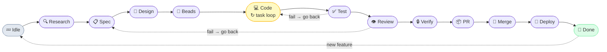

# C4Flow

> Agentic development workflow plugin for Claude Code — from idea to deployment, one phase at a time.



---

## Install

**Claude Code:**
```bash
claude plugins marketplace add https://github.com/tunneleven/C4Flow
claude plugins install c4flow
```

**Codex CLI:**
```
Fetch and follow instructions from https://raw.githubusercontent.com/tunneleven/C4Flow/main/.codex/INSTALL.md
```

**Antigravity IDE:**
```
Fetch and follow instructions from https://raw.githubusercontent.com/tunneleven/C4Flow/main/.antigravity/INSTALL.md
```

---

## Usage

```bash
# Start a new feature workflow
/c4flow:run "user authentication with OAuth"

# Resume where you left off
/c4flow:run

# Check current state
/c4flow:status
```

The orchestrator picks up the current phase, dispatches sub-agents for heavy lifting, and asks for your input at key decisions.

---

## How It Works

Each `/c4flow:run` call advances one phase. State persists to `docs/c4flow/.state.json` so you can stop and resume anytime.

### Phase 1 — Research & Spec

**`/c4flow:research`** — Web research via sub-agent. Produces `research.md` with market analysis, competitive landscape, and tech options.

**`/c4flow:spec`** — Interactive spec generation. Produces:
```
docs/specs/<feature>/
  proposal.md     # Why + what to build
  tech-stack.md   # Technology decisions
  spec.md         # Behavioral specs (GIVEN/WHEN/THEN)
  design.md       # Technical architecture
```

### Phase 2 — Design & Tasks

**`/c4flow:design`** — Generates a design system (OKLCH tokens, typography, spacing) and screen mockups via [Pencil MCP](https://docs.pencil.dev/getting-started/ai-integration). Produces:
```
docs/c4flow/designs/<feature>/
  MASTER.md       # Design tokens + component list
  screen-map.md   # Screen breakdown
  <feature>.pen   # Pencil file with all screens
```

**`/c4flow:beads`** — Breaks the spec into a tracked task epic. Asks your preferred granularity level (compact → atomic) and estimates task count before breaking down.

### Phase 3–6 — Code → Deploy

Sub-agents implement features task-by-task using TDD, run tests, create PRs, and deploy — while you review and approve at gates.

---

## Setup

```bash
# Bootstrap project tooling (Dolt + Beads + optional GitHub/CodeRabbit)
/c4flow:init
```

### Optional: Pencil MCP

Install from [pencil.dev](https://docs.pencil.dev/getting-started/ai-integration) for visual screen mockups. Without it, the Design phase is skipped gracefully.

### Optional: Beads

```bash
npm install -g @tunneleven/beads
```

Without Beads, task breakdowns fall back to `tasks.md`.

---

## Skills

| Phase | Skill | Description |
|-------|-------|-------------|
| Orchestrator | `c4flow` | State machine driver |
| Init | `init` | Bootstrap project tooling |
| Research | `research` | Web research sub-agent |
| Spec | `spec` | Proposal, tech-stack, spec, design docs |
| Design | `design` | Design system + screen mockups |
| Task Breakdown | `beads` | Epic + dependency work graph |
| Implementation | `code`, `tdd` | Feature coding with TDD |
| Testing | `test`, `e2e` | Unit + end-to-end tests |
| Review & QA | `review`, `verify` | AI code review + quality gate |
| Release | `pr`, `infra`, `merge`, `deploy` | PR, infra, merge, deploy |

---

## License

MIT — v0.7.6
